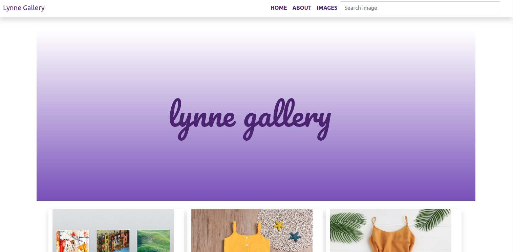

# Lynne's Gallery

## Description
Personal gallery application that you display your photos for others to see.

## User Stories

User Can :-

* View different photos that interest me.
* Click on a single photo to expand it and also view the details of the photo. The photo details must appear on a modal within the same route as the main page.
* Search for different categories of photos. (ie. Travel, Food)
* Copy a link to the photo to share with my friends.
* View photos based on the location they were taken.

Home page



## Behaviour Driven Development
| Behaviour | Input | Output |
| :---------------- | :---------------: | ------------------: |
| Application starts | **On page load** | see a search bar and some sample images |
| Search| **images** | Redirects to images page where you can view image details |
| Image click | **Image click** | redirects to images page where you can view full details of the image|
| click on copy  link | **Button click** | Copies image link that can be shared with others|
| view image button | **button click** | displays the full image|


## Installation Requirements

### Prerequisites

- Django
- Pip & Python
- Pillow 
- Postgres Database

## Instructions

To use this gallery project .......  
  
##### Clone Repository:  
 ```bash 
https://github.com/linetlucy-genchabe/Lynne-Gallery.git 
```
##### Install and activate Virtual Environment virtual  
 ```bash 
cd tribune && python3 -m venv virtual && source virtual/bin/activate 
```  
##### Install Dependencies  
 ```bash 
 pip install -r requirements.txt 
```  
##### Setup Database  
  SetUp Database User,Password, Host then following Command  
 ```bash 
python manage.py makemigrations lynnegallery
 ``` 
 Now Migrate  
 ```bash 
 python manage.py migrate 
```
##### Run Application  
 ```bash 
 python3 manage.py runserver 
 
```
##### Test Application  
 ```bash 
 python manage.py test lynnegallery
```
Open the application on your browser `127.0.0.1:8000`.  


## Technologies Used
* python
* html5
* Django
* Postgres

## License

MIT LICENSE

## Live Site

#### https://lynnegallery.herokuapp.com/
 

<p align = "center">
    &copy; 2022 @linetlucy genchabe.
</p>